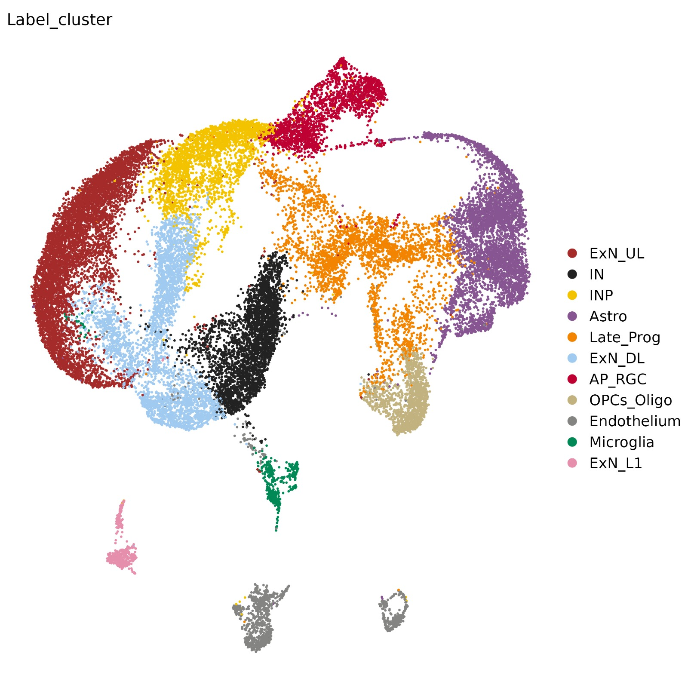
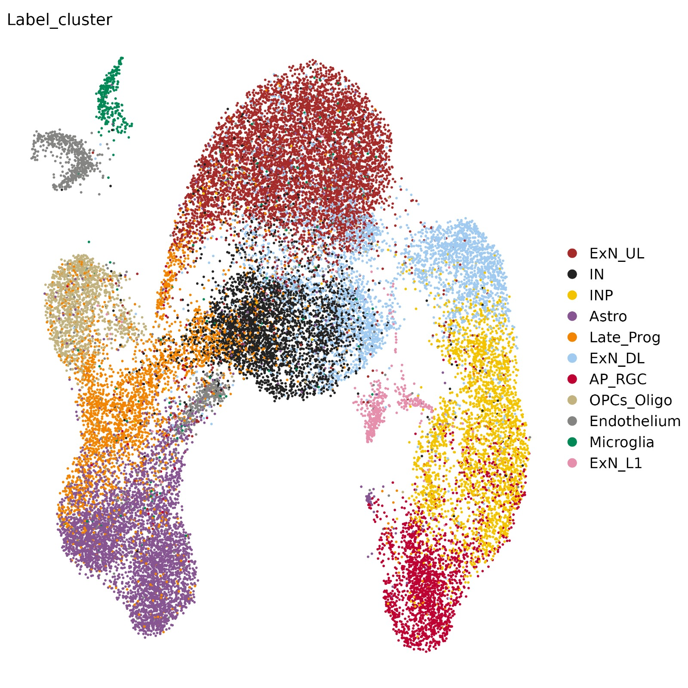

<!-- PROJECT LOGO -->
 

  <a href=>
  <h3 align="center"> Balanced SET levels favor the correct enhancer repertoire during cell fate acquisition
</h3>
  </a>
  

    Mattia Zaghi, Federica Banfi, Luca Massimino, Monica Volpin, Edoardo Bellini, Simone Brusco, Ivan Merelli, Cristiana Barone, Cristina Sironi, Michela Bruni, Linda Bossini, Luigi Lamparelli, Laura Pintado, Deborah D'Aliberti, Luca Mologni, Gaia Colasante, Federica Ungaro, Jean-Michel Cioni, Emanuele Azzoni, Rocco Piazza, Eugenio Montini, Vania Broccoli and Alessandro Sessa
  

<!-- TABLE OF CONTENTS -->

  
Table of Contents

  <ol>
  <li>
      <a href="#About the paper">About the paper</a>
  </li>
    <li>
      <a href="#pipelines">Pipelines</a>
    </li>
    <li>
      <a href="#figures">Figures</a>
    </li>
  </ol>

<!-- About the paper -->
## About the paper

In this work we described the effect of SET protein accumulation on chromatin rewiring in vitro, using SET overexpressing iPSCs and derived NPCs, Schinzel-Giedion syndrome patients iPSCs derived neural cells, and in vivo using Mouse and Zebrafish model. We used a multiomic approach combining ATAC-seq, ChIP-seq, Hi-C, RNA-seq and scMultiome (ATAC+RNA) to address the question on a genomic standpoint. In this page all the codes and pipelines used to analyze all data and produce the manuscript figures are deposited.

Preprint version of the work is available at:

https://www.biorxiv.org/content/10.1101/2022.09.12.507599v1

Figure folders have now been updated containing the updated version of the code after the first round of revision process. Codes contains the reference to the old figures number and format in the preprint version.

Final version of the paper is now published and available:

https://www.nature.com/articles/s41467-023-39043-x

<!-- Epigenomics -->
## Epigenomics
In this folder the snakemake pipelines, bash and R script used to analyzed the epigenomic/trascriptomic data from raw files to intermediate dataset (ATAC, ChIP-seq, Hi-C, RNA-seq, scMultiome), are deposited. Within the folder are present:

* `.sk` files, that contain all rules sequence.

* `.yaml` file, that must be edit according to organism and statistics and user needs.

* `.R` files, custom R script use to analyze a specific dataset.

<!-- Figures -->
## Figures
In Figures folder are present all the costum snakemake and `.R` script used to generate plots and figures. Each figure folder contain the code used to generate it and its related supplementary figure.

<!-- CONTACT -->
## Contacts

Mattia Zaghi - <zaghi.mattia@hsr.it>

Edoardo Bellini - <bellini.edoardo@hsr.it>

Alessandro Sessa - <sessa.alessandro@hsr.it>

<!-- MARKDOWN LINKS & IMAGES -->
<!-- https://www.markdownguide.org/basic-syntax/#reference-style-links -->
[contributors-shield]: https://img.shields.io/github/contributors/othneildrew/Best-README-Template.svg?style=for-the-badge
[contributors-url]: https://github.com/othneildrew/Best-README-Template/graphs/contributors
[forks-shield]: https://img.shields.io/github/forks/othneildrew/Best-README-Template.svg?style=for-the-badge
[forks-url]: https://github.com/othneildrew/Best-README-Template/network/members
[stars-shield]: https://img.shields.io/github/stars/othneildrew/Best-README-Template.svg?style=for-the-badge
[stars-url]: https://github.com/othneildrew/Best-README-Template/stargazers
[issues-shield]: https://img.shields.io/github/issues/othneildrew/Best-README-Template.svg?style=for-the-badge
[issues-url]: https://github.com/othneildrew/Best-README-Template/issues
[license-shield]: https://img.shields.io/github/license/othneildrew/Best-README-Template.svg?style=for-the-badge
[license-url]: https://github.com/othneildrew/Best-README-Template/blob/master/LICENSE.txt
[linkedin-shield]: https://img.shields.io/badge/-LinkedIn-black.svg?style=for-the-badge&logo=linkedin&colorB=555
[linkedin-url]: https://linkedin.com/in/othneildrew
