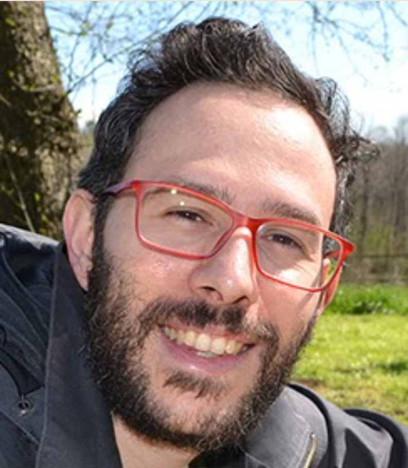
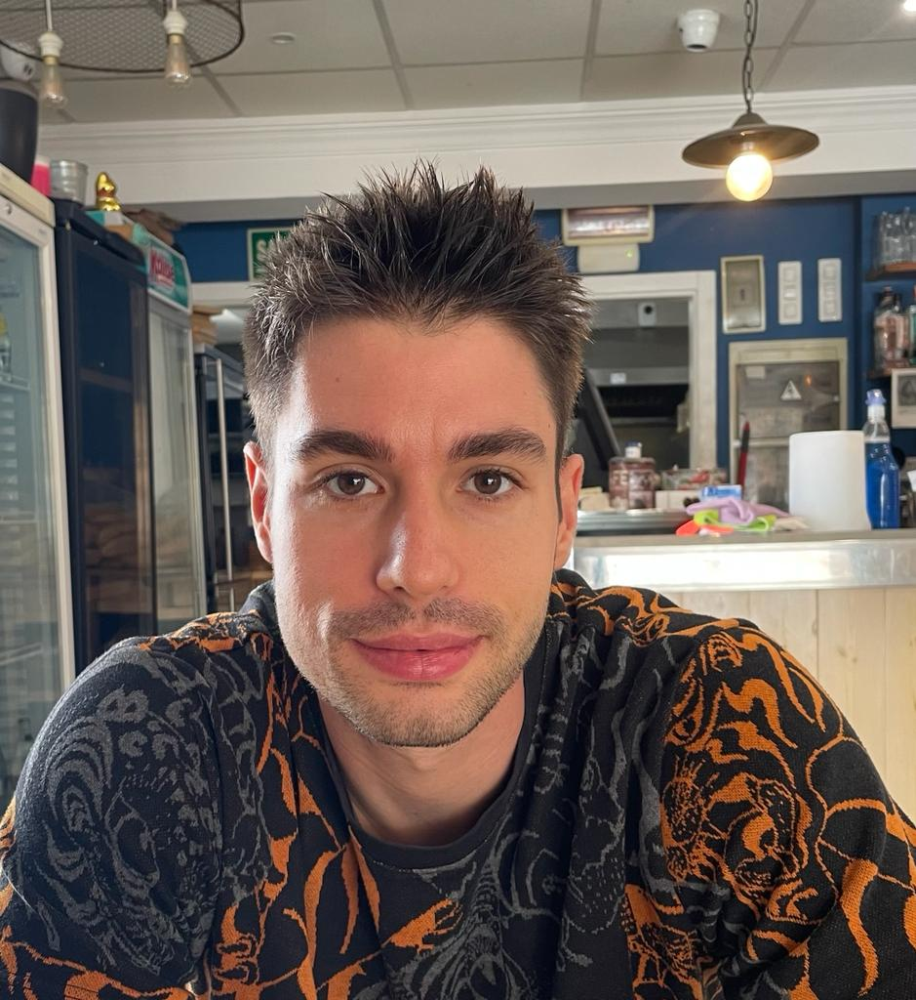
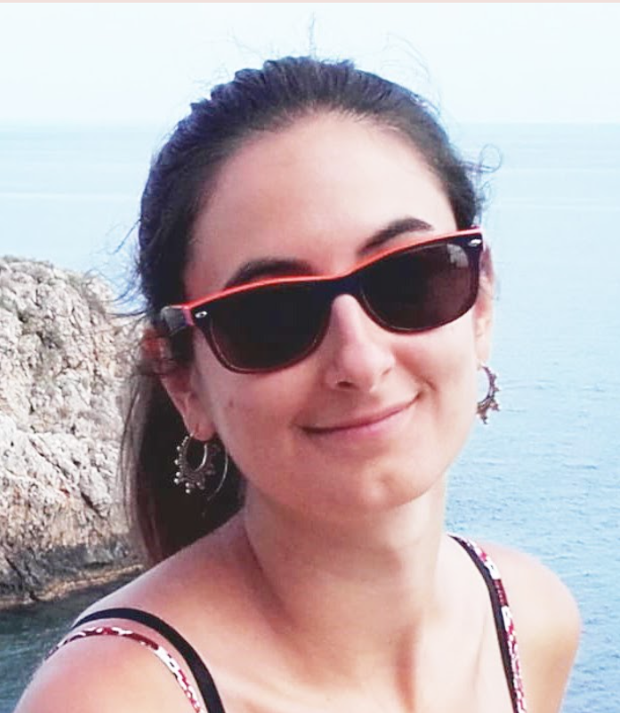
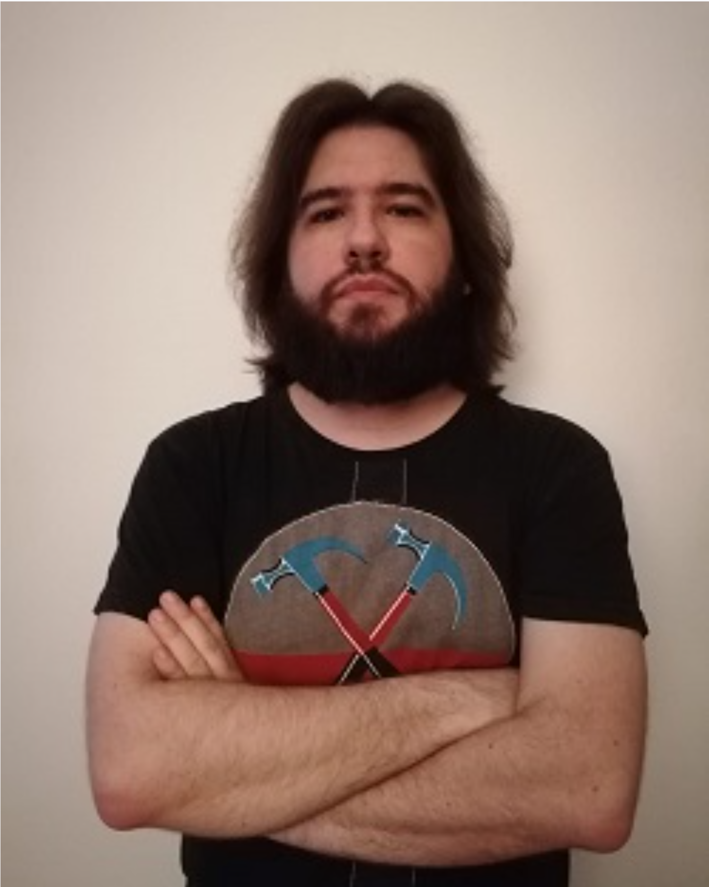

[![Contributors][contributors-shield]][contributors-url]
[![Forks][forks-shield]][forks-url]
[![Stargazers][stars-shield]][stars-url]
[![Issues][issues-shield]][issues-url]
[![MIT License][license-shield]][license-url]
[![LinkedIn][linkedin-shield]][linkedin-url]


<!-- PROJECT LOGO -->
<br />
<p align="center">
  <a href="https://research.hsr.it/en/divisions/neuroscience/stem-cells-and-neurogenesis.html">
  <h3 align="center"> Sessa Lab </h3>
  </a>
  <p align="center">
    Stem Cells and Neurogenesis DIBIT2 C1, Floor 4, Room 50A
  </p>
</p>

<!-- TABLE OF CONTENTS -->
<details open="open">
  <summary>Table of Contents</summary>
  <ol>
  <li>
      <a href="#about-the-lab">About the lab</a>
  </li>
  <li>
      <a href="#people">People</a>
  </li>
    <li>
      <a href="#pipelines">Pipelines</a>
    </li>
    <li>
      <a href="#scripts">Scripts</a>
    </li>
    <li>
      <a href="#publications">Scripts</a>
    </li>
    <li><a href="#contact">Contact</a></li>
  </ol>
</details>


<!-- ABOUT THE LAB -->
## About The Lab

The main focus of our team is characterizing the molecular causes of Neurodevelopmental Disorders such as Autsim Spectrum Disorders and Intellectual disabilities among others. We believe that investigating the causes of these pathologies is on the one hand essential to try to improve the poor quality of life the patients involved. On the other hand is an interesting way to help us to understand the specific function of several molecular involeved in this complex process. We have extensive experience in generating and/or characterzied several mouse and Induced Pluripotent Stem Cells derived models of NDDs that we used to described the function, and associated pathological mechanisms, of several genes. To characterize these models we use a multilayer approach that includes biochemistry, cytochemistry, genomics, electrophisiology and behavioural studies. 
Moreover we are exploting our experience in development and epigenetics to investigate possible therapeutic approaches for conventional therapy resistent tumors such as GBM.

<!-- people -->
## People
<ul>
  <li> <a href="https://research.hsr.it/en/divisions/neuroscience/stem-cells-and-neurogenesis/alessandro-sessa.html">Alessandro Sessa</a> </p>
<p align="center">
 </p> 
</p> 
Alessandro is within the group since 2005. Under Vania’s supervision, he obtained a Ph.D. in Molecular Medicine in 2008. Over the years, he has studied genetic and epigenetic factors that influence brain development, ranging from specific cell populations to molecular pathways. Recently, he has worked on modeling rare diseases and developing tools to intercept pathogenic transformations as a staff scientist and team leader.
</p>
</li>
  <li><a href="zaghi.mattia@hsr.it">Mattia zaghi</a>  <p align="center">
 </p>  Mattia Zaghi obtained his BSC and MSC degree in biotechnology at Vita-Salute San Raffaele University. During his master, he joined Dr. Alessandro Sessa's group in VB Unit focusing his scientific interest in characterizing the epigenetic bases of neuro-developmental disorders such as intellectual disabilities and autism. He then completed the PhD programm in molecular medicine at Vita-Salute San Raffaele university, with a thesis about the role of SETBP1-SET protein axes in controlling chromatin structure and gene expression during neural development, in the context of rare sindrome Schinzel-Giedion. During his postdoctoral fellowship, he continues to research neurodevelopmental disorders, implementing protocols for several genomic experiments, and providing bioinformatic support to group projects.</p>
</p>
</li>
  <li><a href="banfi.federica@hsr.it">Federica Banfi</a> <p align="center">
 </p> Federica Banfi works as a postdoc at San Raffaele Scientific Institute in Milan in the stem cell and neurogenesis unit. She received her Bachelor's degree in Biological Sciences (2013) and her Master's degree in Molecular Biology of the Cell (2015) from the University of Milan. Under the supervision of Dr. Alessandro Sessa, she completed her Ph.D. in Molecular Medicine (Neuroscience curriculum) at Vita-Salute San Raffaele University in 2020, focusing on the role of SETBP1 in brain development and the Schinzel-Giedion syndrome. Overall, she gained expertise in neurodevelopmental disease in vitro modeling, using induced pluripotent stem cells (iPSC) and their differentiation to neuronal lineage and 3D cerebral organoids. </p>
</p> 
  </li>
  <li><a href="https://research.hsr.it/en/centers/omics-sciences/bioinformatics/edoardo-bellini.html">Edoardo Bellini</a>  <p align="center">
 </p> </li> </p> Edoardo Bellini is a computational biologist and Bioinformatician working on basic research in Vania Broccoli’s Lab, and in the Bioinformatics Core of the OSR Center for Omics Sciences. His work is focused on all NGS data type coming from neurodegenerative disease models. He earned a Master Degree in Biology in 2018 at the University of Milano Bicocca and a Master in Bioinformatics and Functional Genomics in 2020 at University of Milan and INGM. He has gained previous research experiences at the CNR-Institute of Biomedical Technology analysing neurodegeneration data from LC-MS and Mud-PIT based proteomic technologies coupled to PPI network analysis to extract potentially novel biomarkers of diseases. </p>
  </li>
  <li> <a href="https://research.hsr.it/en/divisions/neuroscience/stem-cells-and-neurogenesis/alessandro-sessa.html">Raquel Moll Diaz</a> <p align="center">
 </p> </li> </p> Raquel received a B.S. in Biotechnology from Polytechnic University of Valencia, Spain. She did her final bachelor project focused on a rare neurodegenerative disease at the Institute of Biomedicine of Valencia from the CSIC (Spanish national research council). Later, she moved to Belgium where she worked as an intern at S-Biomedic N.V. in Beerse. In 2020 she graduated with a M.S. in Translational Medical Research from University of Heidelberg, Germany. She joined Biomed-X Institute to carry out her master thesis in the Early Intervention of Psychiatric Diseases team. Since 2021, Raquel is working at the MNE UNit in OSR as a research fellow in the Glioblastoma project.
</p> 
</li>
  </li>
  <li> <a href="https://research.hsr.it/en/divisions/neuroscience/stem-cells-and-neurogenesis/alessandro-sessa.html">Linda Bossini </a> <p align="center">
 </p> </li> 
</p> Linda Bossini 
</p>  
</li>
  </li>
  <li> <a href="https://research.hsr.it/en/divisions/neuroscience/stem-cells-and-neurogenesis/alessandro-sessa.html">Silvia Ferretti </a> <p align="center">
 </p> </li> 
</p> Silvia Ferretti 
</p>  
</li>
  </ul>


<!-- Pipelines -->
## Pipelines
In pipeline folder are present all our lab piplines in snakemake. Within every folder are present:
* `.sk` file, that contain all rules sequence.
 ```bash 
 head pipeline/Chip_seq/Chipseq.sk

 # lib
from snakemake.io import glob_wildcards, expand
import glob,os
import pathlib
import pandas as pd
#import multiqc

#config
configfile: "config_ATAC_2.yaml"
```

* `.yaml` file, that must be edit according to organism and statistics and user needs.
 ```bash 
 cat pipeline/Chip_seq/config.yaml

# proj parameters
Project: "prova_chip_seq"
skipH: 6
RAWDATA: "/beegfs/scratch/ric.broccoli/ric.broccoli/prova_chip_seq"
RUN_ID: "prova_chip_seq" # "RUN_id"
# genome
genome: "hg38"
ref_genome_fa: "/beegfs/scratch/ric.broccoli/ric.broccoli/Genomes/hg38/fa/hg38.fa"
chrom_sizes: "/beegfs/scratch/ric.broccoli/ric.broccoli/Genomes/hg38/hg38.chrom.sizes"
# trimming
adapters: "/beegfs/scratch/ric.broccoli/ric.broccoli/adapters/NexteraPE-PE.fa"
# blacklist
blacklist_url: "http://mitra.stanford.edu/kundaje/akundaje/release/blacklists/hg38-human/hg38.blacklist.bed.gz"
# peaks
genome_size_bp: 3209286105
peaks_qvalue: 0.01
broad_cut_off: 0.001
```
* `.csv` file conteins all information abount the metadata of the samples such as sample condition, or whatever you need to specify.
 ```bash
cat pipeline/Chip_seq/samplesheet.csv

[Header],,,,,,,,,,,
IEMFileVersion,4,,,,,,,,,,
Date,2019-06-07 08:32:36+00:00,,,,,,,,,,
,,,,,,,,,,,
[Reads],,,,,,,,,,,
,,,,,,,,,,,
,,,,,,,,,,,
[Settings],,,,,,,,,,,
,,,,,,,,,,,
[Data],,,,,,,,,,,
Lane,Sample_ID,Sample_Name,Sample_Plate,Sample_Well,I7_Index_ID,index,I5_Index_ID,index2,Sample_Project,Description,Container_Label
,CtrlH3K27acChIP-Seq2_S189_R1_001.fastq.gz,CtrlH3K27acChIP-Seq2_S189_R1_001.fastq.gz,,,UDI0073,CAATTAAC,UDI0073,CGAGATAT,prova_chip_seq,,
,CtrlH3K27acChIP-Seq2_S189_R2_001.fastq.gz,CtrlH3K27acChIP-Seq2_S189_R2_001.fastq.gz,,,UDI0073,CAATTAAC,UDI0073,CGAGATAT,prova_chip_seq,,
,InputCtrlChIP-Seqs_S182_R1_001.fastq.gz,InputCtrlChIP-Seqs_S182_R1_001.fastq.gz,,,UDI0073,CAATTAAC,UDI0073,CGAGATAT,prova_chip_seq,,
,InputCtrlChIP-Seqs_S182_R2_001.fastq.gz,InputCtrlChIP-Seqs_S182_R2_001.fastq.gz,,,UDI0073,CAATTAAC,UDI0073,CGAGATAT,prova_chip_seq,,
 ```

<!-- SCRIPTS -->
## Scripts
In scripts folder are present stand alone script used generally to perform downstream analisys like scRNA-seq clustering, Bulk RNA-seq, or custom plot.


<!-- PUBLICATIONS -->
## Publications

<!-- CONTACT -->
## Contacts


Edoardo Bellini - <bellini.edoardo@hsr.it>

Mattia Zaghi - <zaghi.mattia@hsr.it>

Alessandro Sessa - <sessa.alessandro@hsr.it>

<!-- MARKDOWN LINKS & IMAGES -->
<!-- https://www.markdownguide.org/basic-syntax/#reference-style-links -->
[contributors-shield]: https://img.shields.io/github/contributors/othneildrew/Best-README-Template.svg?style=for-the-badge
[contributors-url]: https://github.com/othneildrew/Best-README-Template/graphs/contributors
[forks-shield]: https://img.shields.io/github/forks/othneildrew/Best-README-Template.svg?style=for-the-badge
[forks-url]: https://github.com/othneildrew/Best-README-Template/network/members
[stars-shield]: https://img.shields.io/github/stars/othneildrew/Best-README-Template.svg?style=for-the-badge
[stars-url]: https://github.com/othneildrew/Best-README-Template/stargazers
[issues-shield]: https://img.shields.io/github/issues/othneildrew/Best-README-Template.svg?style=for-the-badge
[issues-url]: https://github.com/othneildrew/Best-README-Template/issues
[license-shield]: https://img.shields.io/github/license/othneildrew/Best-README-Template.svg?style=for-the-badge
[license-url]: https://github.com/othneildrew/Best-README-Template/blob/master/LICENSE.txt
[linkedin-shield]: https://img.shields.io/badge/-LinkedIn-black.svg?style=for-the-badge&logo=linkedin&colorB=555
[linkedin-url]: https://linkedin.com/in/othneildrew
[product-screenshot]: images/screenshot.png
